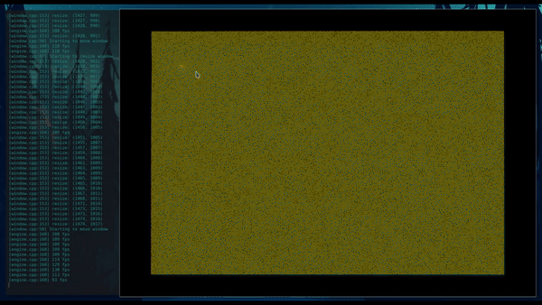

Vulkan particles
================

Just a small example showing how to effectively use some of my projects.
- [ny](https://github.com/nyorain/ny) as window abstraction,
- [vpp](https://github.com/nyorain/vpp) as vulkan utility
- [bintoheader](https://github.com/nyorain/bintoheader) to spirv c headers
- [dlg](https://github.com/nyorain/dlg) as logging library

Consists of only 3 parts (6 files, header + source for each).
- window: implements ny::WindowListener, handles window events
- render: implements vpp::Renderer, manages the swapchain and pipelines
- engine: just brings the other components together and implements the main loop.

One can toggle between {1, 2, 4, 8} samples by using the associated 
keyboard keys and there are several other window-related keybindings (see
window.cpp).

Everything is brought together using meson, building it will 
download the dependencies automatically.
Requires a solid C++17 compiler, clang 5 and gcc 7 are supported.
Also requires 'glslangValidator' to be in a binary path where it can be found by meson.
Works on windows and linux (native x11 and wayland support) and android (due
to the ny-android backend).
